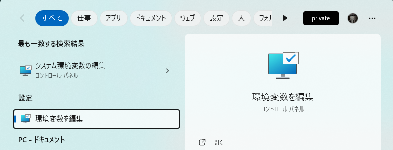
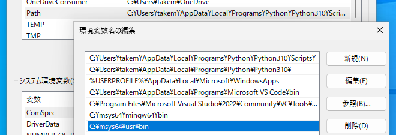
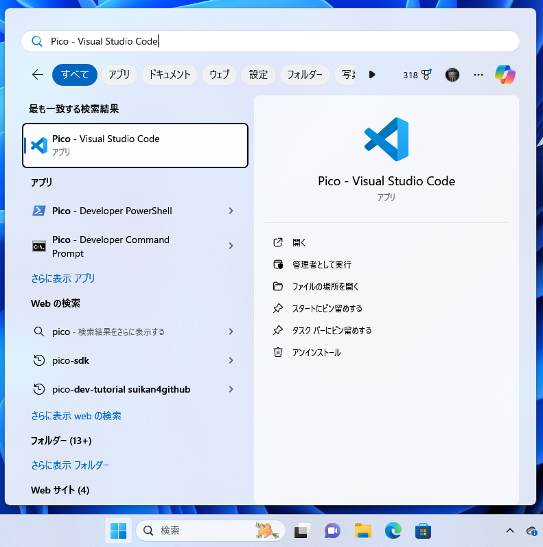

# pico-env-easy
Setting Up RaspberryPi Pico SDK easily

# 詳細
RaspberryPi Picoの開発のための環境を簡単に設定するためのスクリプトです。

以下の環境で試験しています

- Ubuntu 22.04 LTS
- Ubuntu 22.04 LTS on WSL

なお、必須ツールに加えてgitとdoxygenもインストールしています。

# インストールの仕方
OSごとのディレクトリに移動してスクリプトを実行します。

## Ubuntu
Ubuntu用のスクリプトは、ビルドに必要なツールの他にVS Codeの.deb版をダウンロードして
インストールします。


```sh
cd ubuntu
sudo ./install_tools
```

すでにVS Codeをインストール済みの場合は、VSCをインストールしないスクリプトを実行してください。

```sh
cd ubuntu
sudo ./install_without_vscode
```

VS Codeをインストールしたら起動して[C/C++ Extention Pack](https://marketplace.visualstudio.com/items?itemName=ms-vscode.cpptools-extension-pack)を拡張機能としてインストールしておいてください。

## Ubuntu on WSL
Ubuntu用のスクリプトは、ビルドに必要なツールをインストールします。これらのツールは
ubuntu版と共通です。

VS CodeはWSL側にはインストールしませんのでWSLのホストであるWindowsにインストールしてください。

VS Codeをインストールしたら起動して[C/C++ Extention Pack](https://marketplace.visualstudio.com/items?itemName=ms-vscode.cpptools-extension-pack)を拡張機能としてインストールしておいてください。

```sh
cd ubuntu_wsl
sudo ./install_without_vscode
```

## Windows
Windows用の開発ツールインストールはRaspberry Pi公式サイトが配布していますのでそちらを使ってください。

- [Raspberry Pi Pico Windows Installer](https://www.raspberrypi.com/news/raspberry-pi-pico-windows-installer/)

ビルド以外に使うツールは[MSYS2](https://www.msys2.org/)を利用します。

### MSYS2の環境変数の設定
MSYS2をインストールするには、まず環境変数を設定します。
[Windowsキー]を押した後"env"と入力し、「環境変数を編集」を選択します。


環境変数の編集ダイアログが現れますので、以下の変数を追加してください。

環境変数 | 値
--------|-------
HOME | %USERPROFILE%
LC_CTYPE | ja_JP.UTF-8
PATH     | C:\msys64\usr\bin
PATH | C:\msys64\mingw64\bin

"%USERPROFILE%"はWindowsによって自動的にユーザーのプロファイル・ディレクトリに置き換えられます。

PATHが2回現れています。PATH変数は最初から存在しますので、その中に2項目追加してください。追加すると以下の図のようになります。



環境変数の設定が終わったら、コマンド・プロンプト・ウインドウを閉じて開きなおしてください。これで環境変数の設定が反映されます。試しに以下の二つのコマンドをコマンド・プロンプト・ウインドウをから実行してみてください。
 
```
echo %USERPROFILE%
echo %HOME%
```

結果が同じなら、設定が正しく反映されています。


なお、環境変数を変更せずにコマンド・プロンプト・ウインドウを開く度に[windows/set_env.bat](windows/set_env.bat)を実行しても構いません。ただしコマンド・プロンプト・ウインドウを閉じるとバッチファイルで設定した環境変数は元に戻ります。

```cmd
set_env.bat
```

注意：パスを設定するバッチファイルは1度しか実行してはいけません。複数回実行するとその都度のPATH変数の値が伸びていきます。

### MSYS2のインストール
環境変数の設定が終わったら、Windowsのコマンド・プロンプト・ウインドウから以下のコマンドを実行してMSYS2をインストールします。

```cmd
winget install MSYS2.MSYS2
```

実行が終了したら、パッケージ情報を更新します。MSIS2は初回によく使うプログラム類だけインストールしますが、それらは必ずしも最新ではありません。そこでパッケージの更新が必要になります。パッケージ管理にはpacmanを使います。

```cmd
pacman -Syu
```

これでパッケージ情報が更新されます。最後に、よく使う便利なツールもインストールしておきましょう。

```cmd
pacman -S git doxygen
```

### Visual Studioの実行
Windows版の開発環境を実行するときには、スタートメニューから"Pico - Visual Studio Code"を実行してください（下図）。

このメニューではなく通常のVisual Studio Codeを開くと正しくパスが設定されないため、プログラムをビルドできません。
なお、[Raspberry Pi Pico Windows Installer](https://www.raspberrypi.com/news/raspberry-pi-pico-windows-installer/)にはVisual StudioのC/C++ Buildツールが含まれています。
ですので、"Pico - Visual Studio Code"を使えばCMakeを使ってWindowsのCLIプログラムも開発することができます。

